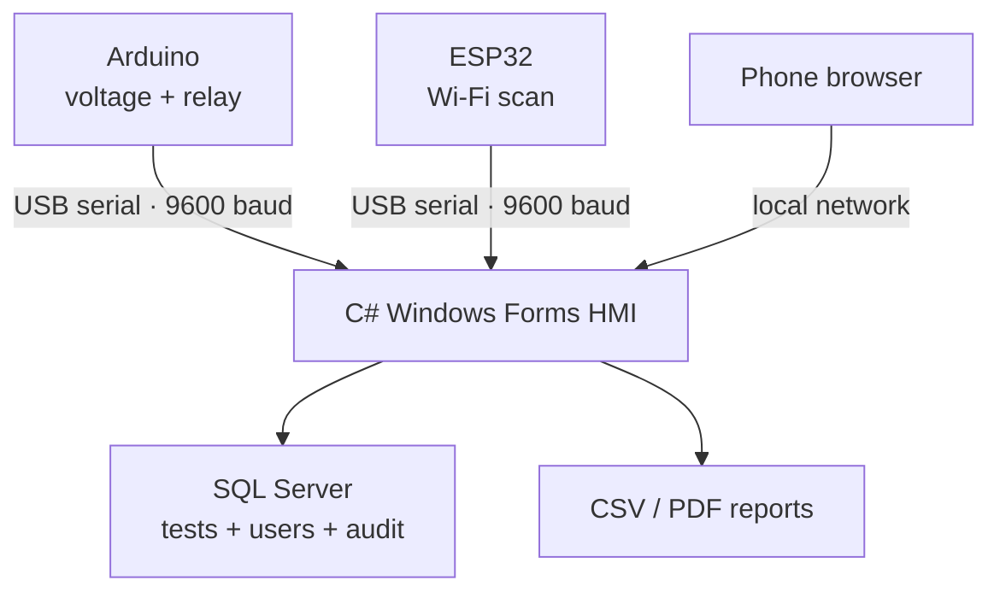

# Arduino & ESP32 Process Test and Traceability Station

[Türkçe](README_TR.md)

A C# Windows Forms application for monitoring two independent serial test nodes, evaluating configurable acceptance limits, controlling an Arduino relay output, storing traceable results in SQL Server, analyzing failures, and generating CSV/PDF reports.

The system supports:

- an **Arduino voltage and relay station** that reads a potentiometer, evaluates lower/upper voltage limits, and controls active-low relay outputs;
- an **ESP32 Wi-Fi quality tester** that reports the strongest RSSI value and detected network count;
- two independent serial connections that can operate separately or simultaneously;
- SQL Server logging with serial number, source, operator, result, error code, and timestamp;
- live charts, PASS/FAIL statistics, error-code analysis, PDF/CSV export, user roles, audit records, and a local network dashboard.

## System overview



## Application screens

| Live dual-source monitoring | ESP32 Wi-Fi monitoring |
|---|---|
|  |  |

| Error analysis | Reporting and administration |
|---|---|
|  |  |

| Hardware PASS state | Hardware low-voltage FAIL state |
|---|---|
|  |  |

## Main functions

| Area | Function |
|---|---|
| Serial communication | Independent Arduino and ESP32 COM ports at 9600 baud |
| Limit evaluation | Configurable Arduino voltage range and ESP32 RSSI threshold |
| Physical output | Arduino relay, motor relay, PASS/FAIL LEDs, buzzer, and OLED |
| Traceability | SQL records with serial number, source, operator, batch, and time |
| Analysis | Live plots, total tests, PASS, FAIL, yield, and error distribution |
| Reporting | UTF-8 CSV export and browser-based PDF generation |
| Authorization | First-run Administrator account, user roles, PBKDF2 password hashing, and audit logs |
| Network interface | Responsive LAN dashboard with authenticated control commands |

## Software structure

```text
Application/       Dashboard, HTTP server, reporting, and session services
Communication/     Serial connection and packet parsing
Data/              SQL repositories and schema initialization
Database/          Manual SQL Server setup script
Domain/            User, role, and audit models
Infrastructure/    Logging, networking, and password hashing
firmware/          Arduino and ESP32 sketches
docs/              Wiring, protocol documentation, and images
```

## Requirements

- Windows 10 or Windows 11
- Visual Studio 2022 with **.NET desktop development**
- .NET Framework 4.8 Developer Pack
- SQL Server Express
- Arduino IDE
- `Adafruit GFX` and `Adafruit SSD1306` libraries for the Arduino OLED

## Setup

1. Open `ProcessTestApp.sln` in Visual Studio 2022.
2. Check the `DefaultConnection` value in `App.config`. The default instance is `.\SQLEXPRESS` and the database name is `ProcessTestDb`.
3. Build the solution with `Release / Any CPU`.
4. Upload the required sketch from `firmware/` to the Arduino and/or ESP32.
5. Start the desktop application and create the initial Administrator account.
6. Select a different COM port for each connected device and use `9600` baud.
7. Send the required limits from the live-test screen and start monitoring.

The application creates its database and tables automatically. The equivalent manual SQL script is available at [Database/01_CreateDatabase.sql](Database/01_CreateDatabase.sql).

## Hardware and protocol documentation

- [Arduino and ESP32 wiring — English](docs/hardware-setup.md)
- [Arduino ve ESP32 bağlantıları — Türkçe](docs/hardware-setup_TR.md)
- [Serial protocol — English](docs/communication-protocol.md)
- [Seri haberleşme protokolü — Türkçe](docs/communication-protocol_TR.md)

## Measurement model

Arduino voltage is calculated from the 10-bit ADC value with a 5 V reference assumption. The displayed current is a derived value (`ADC / 1023 × 2.5 A`) and is not measured by a current sensor.

The ESP32 transmits the positive magnitude of RSSI. For example, the transmitted value `37` is displayed as `-37 dBm`. An HMI threshold of `75` therefore represents a minimum acceptable signal level of `-75 dBm`.

The desktop application re-evaluates each valid packet using the active HMI limits before storing the final PASS/FAIL result.

## Local network dashboard

LAN mode is disabled by default. To use the dashboard, set `EnableLanMode=true` in `App.config`, restart the application, and connect from a device on the same trusted private network. Monitoring data is available on the local dashboard; control commands require an Administrator session.

## Safety note

This system is a laboratory prototype. The software E-STOP command is not a safety-rated emergency-stop circuit. Relay logic, load isolation, power ratings, protective devices, and a physical emergency-stop circuit must be verified independently before connecting a real load.
