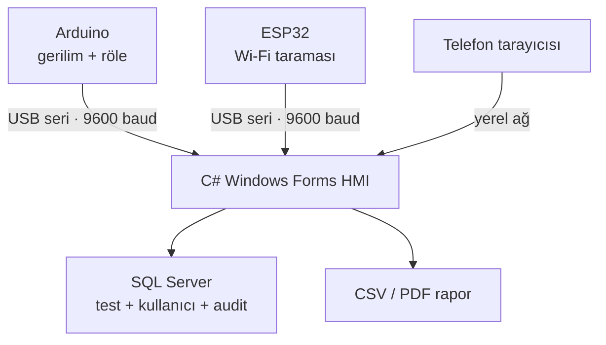
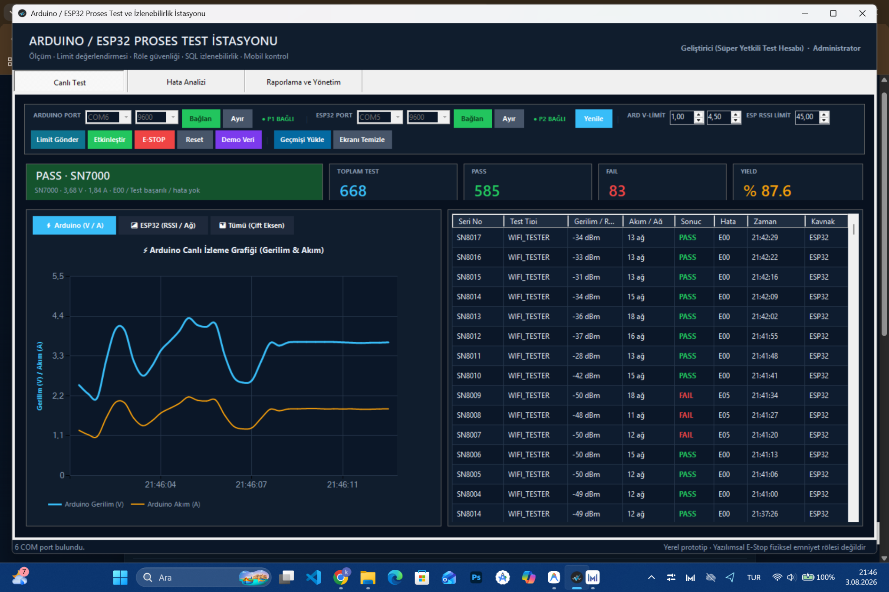
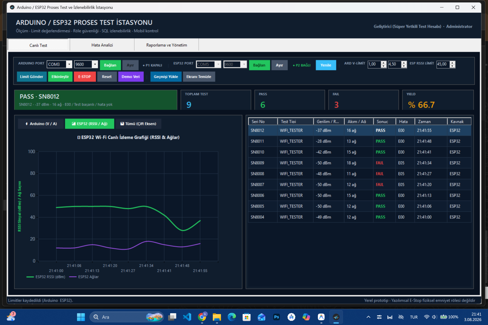
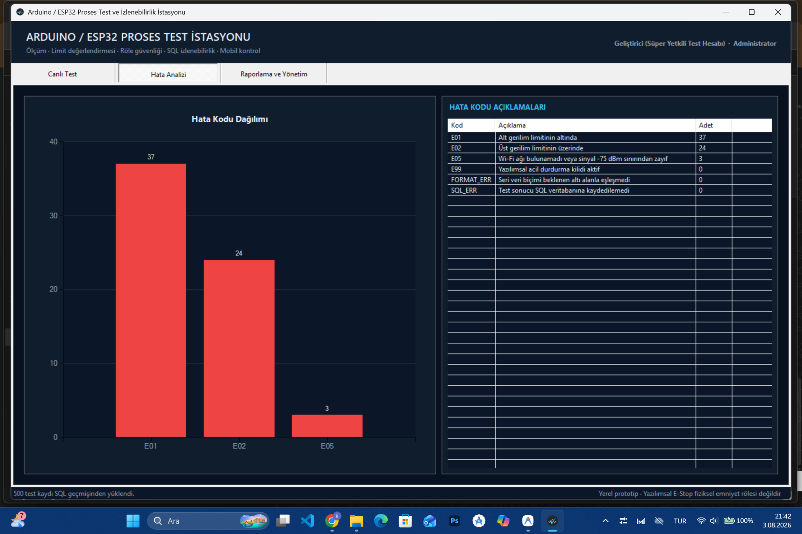
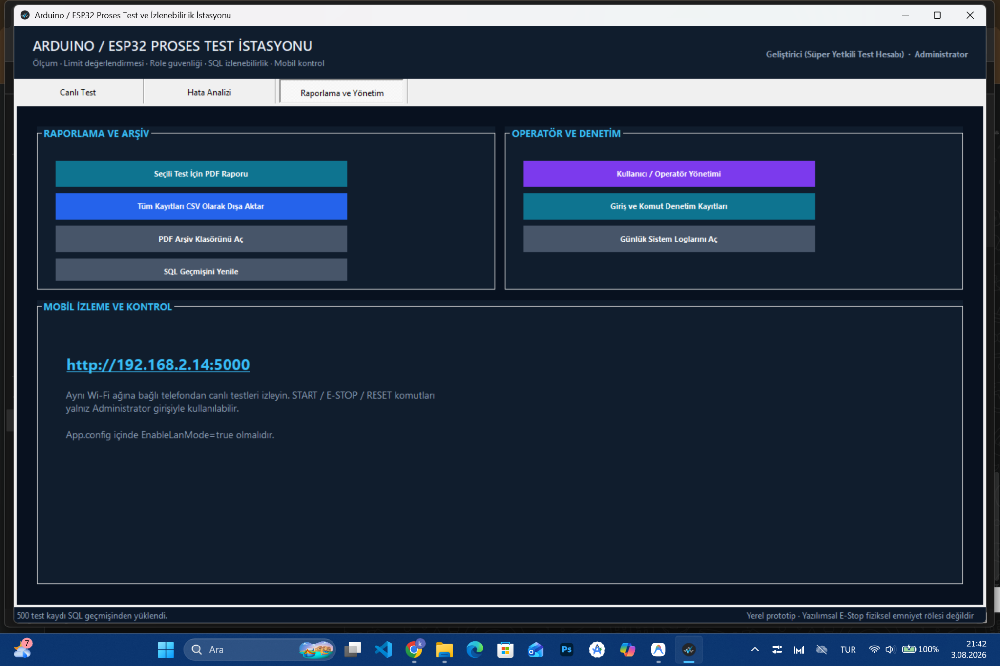
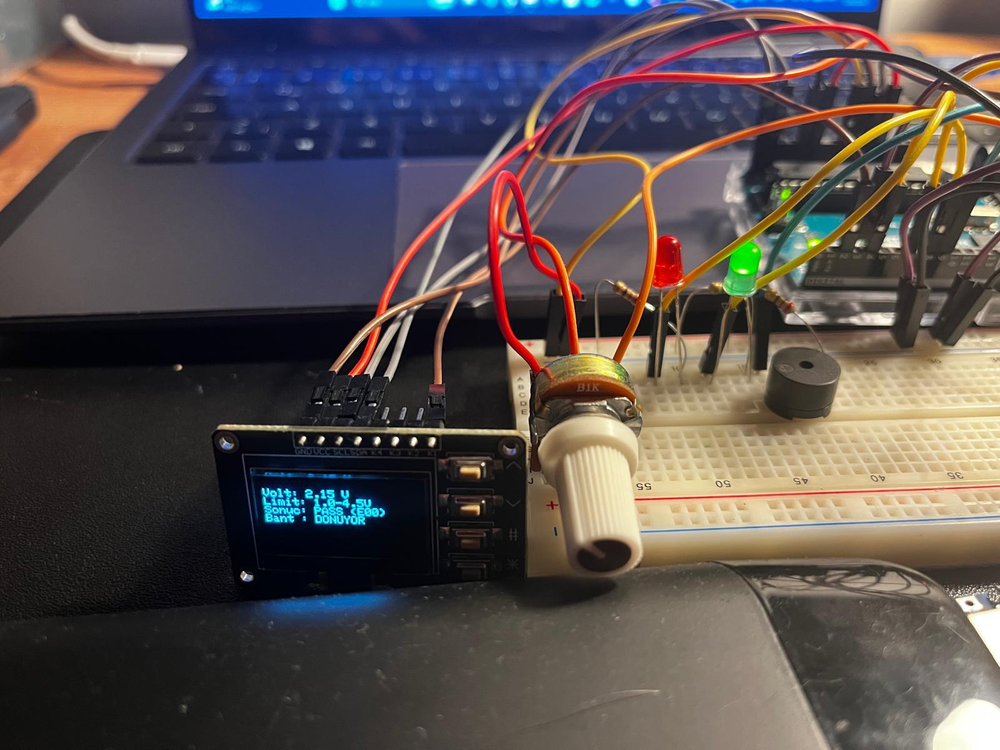
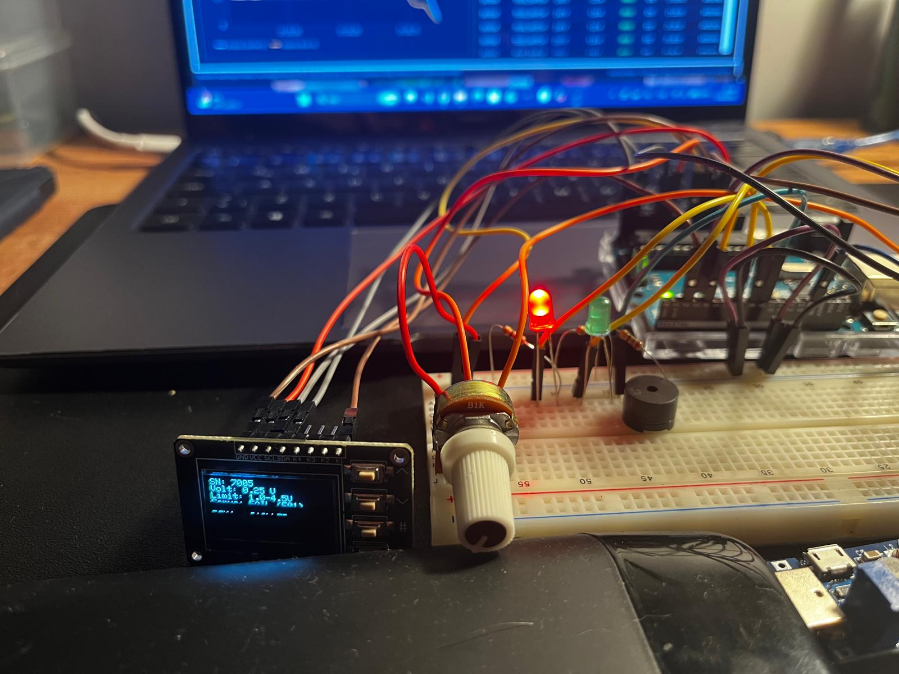

# Arduino ve ESP32 Proses Test ve İzlenebilirlik İstasyonu

[English](README.md)

Bu proje; iki bağımsız seri test düğümünü izleyen, yapılandırılabilir kabul limitlerini değerlendiren, Arduino röle çıkışlarını kontrol eden, sonuçları SQL Server üzerinde izlenebilir biçimde saklayan ve CSV/PDF raporları oluşturan C# Windows Forms uygulamasıdır.

Sistem şu bileşenleri destekler:

- potansiyometreden gerilim okuyan, alt/üst limit değerlendirmesi yapan ve aktif-düşük röle çıkışlarını kontrol eden **Arduino gerilim ve röle istasyonu**;
- en güçlü RSSI değerini ve bulunan ağ sayısını bildiren **ESP32 Wi-Fi kalite test düğümü**;
- ayrı ayrı veya eşzamanlı çalışabilen iki bağımsız seri bağlantı;
- seri numarası, kaynak, operatör, sonuç, hata kodu ve zaman bilgilerini içeren SQL Server kayıtları;
- canlı grafikler, PASS/FAIL istatistikleri, hata analizi, PDF/CSV dışa aktarma, kullanıcı rolleri, denetim kayıtları ve yerel ağ paneli.

## Sistem yapısı



## Uygulama ekranları

| Çift kaynaklı canlı izleme | ESP32 Wi-Fi izleme |
|---|---|
|  |  |

| Hata analizi | Raporlama ve yönetim |
|---|---|
|  |  |

| Donanım PASS durumu | Donanım düşük gerilim FAIL durumu |
|---|---|
|  |  |

## Temel işlevler

| Alan | İşlev |
|---|---|
| Seri haberleşme | Arduino ve ESP32 için bağımsız COM portları, 9600 baud |
| Limit değerlendirmesi | Ayarlanabilir Arduino gerilim aralığı ve ESP32 RSSI eşiği |
| Fiziksel çıkış | Arduino röleleri, motor rölesi, PASS/FAIL LED'leri, buzzer ve OLED |
| İzlenebilirlik | Seri numarası, kaynak, operatör, parti ve zaman bilgili SQL kayıtları |
| Analiz | Canlı grafik, toplam test, PASS, FAIL, yield ve hata dağılımı |
| Raporlama | UTF-8 CSV dışa aktarma ve tarayıcı tabanlı PDF üretimi |
| Yetkilendirme | İlk yönetici hesabı, kullanıcı rolleri, PBKDF2 parola özeti ve audit kayıtları |
| Ağ arayüzü | Kimlik doğrulamalı komutlara sahip duyarlı yerel ağ paneli |

## Yazılım yapısı

```text
Application/       Panel, HTTP sunucusu, raporlama ve oturum servisleri
Communication/     Seri bağlantı ve paket ayrıştırma
Data/              SQL repository sınıfları ve şema kurulumu
Database/          Manuel SQL Server kurulum betiği
Domain/            Kullanıcı, rol ve audit modelleri
Infrastructure/    Loglama, ağ ve parola özeti yardımcıları
firmware/          Arduino ve ESP32 kodları
docs/              Bağlantı, protokol belgeleri ve görseller
```

## Gereksinimler

- Windows 10 veya Windows 11
- Visual Studio 2022 ve **.NET masaüstü geliştirme** iş yükü
- .NET Framework 4.8 Developer Pack
- SQL Server Express
- Arduino IDE
- Arduino OLED için `Adafruit GFX` ve `Adafruit SSD1306` kütüphaneleri

## Kurulum

1. `ProcessTestApp.sln` dosyasını Visual Studio 2022 ile açın.
2. `App.config` içindeki `DefaultConnection` değerini kontrol edin. Varsayılan SQL örneği `.\SQLEXPRESS`, veritabanı adı `ProcessTestDb` olarak tanımlanmıştır.
3. Çözümü `Release / Any CPU` yapılandırmasıyla derleyin.
4. `firmware/` altındaki ilgili kodu Arduino ve/veya ESP32'ye yükleyin.
5. Masaüstü uygulamasını başlatıp ilk Administrator hesabını oluşturun.
6. Bağlanan her cihaz için farklı COM portu ve `9600` baud seçin.
7. Canlı test ekranından gerekli limitleri göndererek izlemeyi başlatın.

Uygulama veritabanını ve tabloları otomatik olarak oluşturur. Eşdeğer manuel SQL betiği [Database/01_CreateDatabase.sql](Database/01_CreateDatabase.sql) dosyasındadır.

## Bağlantı ve protokol belgeleri

- [Arduino ve ESP32 bağlantıları — Türkçe](docs/hardware-setup_TR.md)
- [Arduino and ESP32 wiring — English](docs/hardware-setup.md)
- [Seri haberleşme protokolü — Türkçe](docs/communication-protocol_TR.md)
- [Serial protocol — English](docs/communication-protocol.md)

## Ölçüm modeli

Arduino gerilimi, 10 bit ADC değeri ve 5 V referans varsayımıyla hesaplanır. Ekranda gösterilen akım değeri `ADC / 1023 × 2,5 A` formülüyle türetilir; bir akım sensörüyle ölçülmez.

ESP32, RSSI değerinin pozitif büyüklüğünü gönderir. Örneğin gönderilen `37` değeri ekranda `-37 dBm` olarak gösterilir. HMI üzerindeki `75` eşiği, kabul edilen en düşük sinyalin `-75 dBm` olduğu anlamına gelir.

Masaüstü uygulaması, geçerli her paketi SQL'e kaydetmeden önce etkin HMI limitleriyle yeniden değerlendirir ve nihai PASS/FAIL kararını oluşturur.

## Yerel ağ paneli

LAN modu varsayılan olarak kapalıdır. Paneli kullanmak için `App.config` içindeki `EnableLanMode` değerini `true` yapın, uygulamayı yeniden başlatın ve aynı güvenilir özel ağa bağlı bir cihazdan ekranda gösterilen adrese bağlanın. İzleme verileri yerel panelde görüntülenebilir; kontrol komutları Administrator oturumu gerektirir.

## Güvenlik notu

Bu sistem laboratuvar prototipidir. Yazılımsal E-STOP komutu, güvenlik sınıfına sahip fiziksel acil durdurma devresinin yerine geçmez. Gerçek bir yük bağlanmadan önce röle mantığı, yük izolasyonu, güç değerleri, koruma elemanları ve fiziksel acil durdurma devresi bağımsız olarak doğrulanmalıdır.
